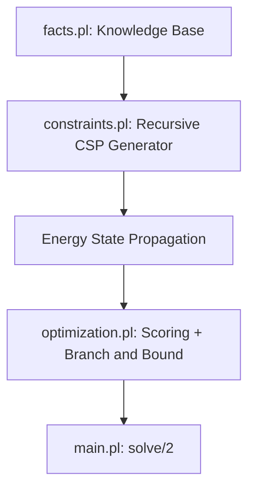

# Intelligent Energy-Aware Campus Resource Scheduling System

## Overview

This project is a Prolog declarative reasoning engine that generates optimized weekly schedules for university courses under room, group, capacity, equipment, instructor availability, temporal, energy, and fairness constraints.

The system models scheduling as a Constraint Satisfaction Problem (CSP). Candidate schedules are built recursively, and invalid partial assignments are rejected as early as possible through Prolog failure and backtracking. The current implementation supports real multi-slot course durations, overlap-based conflict detection, energy-aware pruning, and multi-criteria optimization.

## Architecture

The project is organized into four Prolog modules:

- `facts.pl`  
  Knowledge base: courses, rooms, buildings, groups, instructors, atomic timeslots, `next_slot/2`, and instructor availability.

- `constraints.pl`  
  CSP engine: recursive generation, multi-slot duration handling, overlap-based hard constraints, and energy state propagation.

- `optimization.pl`  
  Multi-criteria evaluation and Branch and Bound optimization using `best_solution/2`.

- `main.pl`  
  Final entry point through `solve/1` and `solve/2`.



## Data Model

The knowledge base uses the following core predicates:

```prolog
course(Course, Sessions, Duration, Group, Equipment).
room(Room, Capacity, Equipment, Building, EnergyCost).
building(Building, MaxEnergy).
timeslot(Time).
next_slot(Time1, Time2).
group_size(Group, Size).
teaches(Instructor, Course).
availability(Instructor, Time).
```

The generated schedule uses the assignment representation:

```prolog
assign(Course, SessionIndex, Room, StartTime, OccupiedSlots)
```

Example:

```prolog
assign(programming_101, 1, lab_alpha, monday_08_09,
       [monday_08_09, monday_09_10])
```

This means:

- `programming_101` session 1 is assigned to `lab_alpha`.
- The session starts at `monday_08_09`.
- Because the course duration is 2, it occupies two consecutive atomic slots.

## Multi-Slot Duration

Course duration is interpreted as the number of consecutive atomic timeslots occupied by each session.

The predicate `consecutive_slots/3` builds the occupied slot list:

```prolog
consecutive_slots(monday_08_09, 1, [monday_08_09]).
consecutive_slots(monday_08_09, 2, [monday_08_09, monday_09_10]).
consecutive_slots(monday_08_09, 3, [monday_08_09, monday_09_10, monday_10_11]).
```

The temporal adjacency relation is defined by `next_slot/2`. If there are not enough consecutive slots from a start time, the predicate fails.

Conflicts are checked by intersecting occupied slot lists rather than comparing only a single start time.


## Hard Constraints

The CSP engine preserves the following hard constraints:

- `no_room_conflict/1`  
  A room cannot host overlapping assignments.

- `no_group_conflict/1`  
  A student group cannot attend overlapping courses.

- `no_instructor_conflict/1`  
  An instructor cannot teach overlapping courses.

- `no_same_course_conflict/1`  
  Two sessions of the same course cannot overlap.

- `capacity_ok/1`  
  The assigned room capacity must be at least the group size.

- `equipment_ok/1`  
  The room must provide the equipment required by the course.

- `availability_ok/1`  
  The instructor must be available for every occupied atomic slot.

During recursive generation, each candidate assignment is checked against the partial schedule using `validate_insertion/2`. This gives early pruning: invalid partial schedules fail immediately instead of being filtered after full schedule construction.

## Energy Model

Each assignment consumes energy based on the room energy cost and the course duration:

```text
assignment_energy = course_duration x room_energy
```

Example:

```text
programming_101 duration = 2
lab_alpha energy cost = 8
assignment_energy = 2 x 8 = 16
```

Energy is accumulated by building and day using the state representation:

```prolog
energy(Building, Day, Value)
```

The predicates `update_energy_state/3` and `energy_ok/2` update this state during schedule construction. If a building/day energy threshold is exceeded, the candidate assignment fails immediately and Prolog backtracks.

## Optimization Model

The optimization score is:

```text
Score = TotalEnergy + 10 x LoadImbalance + 5 x RoomUsageImbalance
```

Definitions:

- `TotalEnergy`: total energy consumed by all assignments.
- `LoadImbalance`: maximum daily energy minus minimum daily energy, considering days present in the schedule.
- `RoomUsageImbalance`: maximum room usage count minus minimum room usage count, considering rooms present in the schedule.

Lower score means a better schedule.

The score combines three goals:

- minimize global energy consumption,
- avoid concentrating energy demand on a single day,
- avoid unfair overuse of one room.

## Branch and Bound Optimization

The optimizer uses `best_solution/2` to store the best complete schedule found so far:

```prolog
best_solution(BestSchedule, BestScore)
```

Prolog backtracking explores valid schedules generated by `generate_schedule/1`. For each complete schedule, `score/2` computes the multi-criteria score. The predicate `update_best/2` replaces the current best solution only when a lower score is found.

This Branch and Bound implementation avoids storing all schedules at once. The previous exhaustive `setof/3` version is still available as `best_schedule_exhaustive/2` for comparison.

Important limitation: the current bounding happens at complete-schedule level. It still evaluates complete schedules generated by `generate_schedule/1`. A stronger future version would integrate partial-score bounds into recursive schedule construction to prune partial branches earlier.

## How to Run

Start SWI-Prolog in the project directory:

```bash
swipl
```

Load the modules:

```prolog
?- [facts].
?- [constraints].
?- [optimization].
?- [main].
```

Run the optimizer:

```prolog
?- solve(Schedule, Score).
```

## Web Interface

The project includes a minimal Node.js backend and React/Vite frontend. SWI-Prolog must be installed and available on the system path as `swipl`.

Run the backend from the project root:

```bash
npm install --prefix backend
node backend/server.js
```

The backend starts on:

```text
http://localhost:3001
```

It exposes:

```text
GET /api/solve
```

Run the frontend:

```bash
cd frontend
npm install
npm run dev
```

The frontend starts on the Vite development URL, usually:

```text
http://localhost:5173
```

Click `Run Solver` to call the backend, execute SWI-Prolog, and display the optimized schedule.

## Example Result

For the current dataset, an optimal score is:

```prolog
Score = 223.
```

The known score components are:

```text
TotalEnergy = 58
LoadImbalance = 16
RoomUsageImbalance = 1
```

Score calculation:

```text
Score = 58 + 10 x 16 + 5 x 1 = 223
```

An example solution is:

```prolog
Schedule = [
  assign(physics_lab, 1, room_c105, tuesday_09_10,
         [tuesday_09_10, tuesday_10_11, tuesday_11_12]),
  assign(calculus_1, 1, room_b201, monday_10_11,
         [monday_10_11]),
  assign(programming_101, 2, lab_alpha, tuesday_08_09,
         [tuesday_08_09, tuesday_09_10]),
  assign(programming_101, 1, lab_alpha, monday_08_09,
         [monday_08_09, monday_09_10])
].
```

Equivalent schedules may be returned if they have the same optimal score.

## Tests

`TESTS.md` contains documented Prolog queries and expected outputs for:

- atomic timeslot facts,
- `next_slot/2`,
- multi-slot duration,
- conflict detection,
- assignment energy,
- total energy,
- score components,
- Branch and Bound versus exhaustive optimization.

## Limitations

- The dataset is intentionally small.
- Branch and Bound currently updates the best solution after complete schedules, not during partial recursive construction.
- Equipment is modeled as a single required type.
- There is no CSV or JSON import pipeline.
- There is no graphical user interface.
- Courses currently have one group and one required equipment type.

## Future Work

- Integrate partial Branch and Bound into recursive schedule generation.
- Test larger datasets.
- Add a CSV/JSON knowledge base generator.
- Support richer equipment requirements.
- Support multiple groups per course.
- Add instructor preferences and soft constraints.
